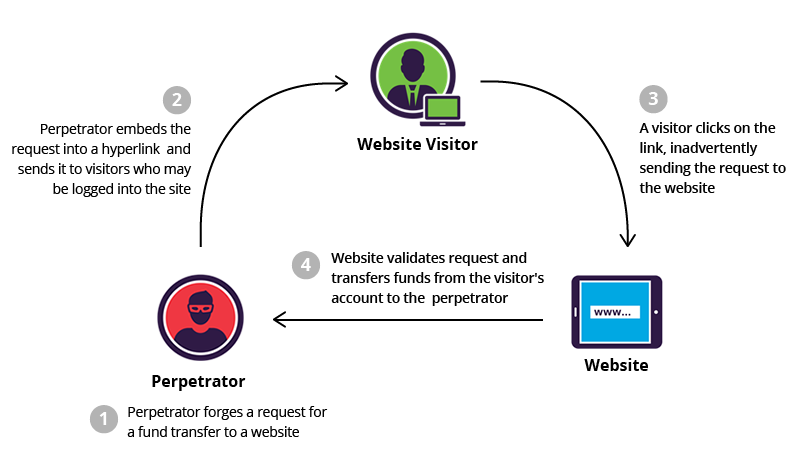

# SpringSecurityDemo
Spring Security Practice 01

## Basic Auth
每次請求，都會夾帶著登入者的帳號以及密碼(64編碼)

## AntMatchers
使用HttpSecurity.antMatchers要注意順序，順序會影響到Spring Security的判斷

>.antMatchers("/","index","/css/*","/js/*").permitAll()
.antMatchers("/api/**").hasRole(STUDENT.name())
.antMatchers(HttpMethod.DELETE,"/management/api/**").hasAuthority(COURSE_WRITE.getPermission())
.antMatchers(HttpMethod.POST,"/management/api/**").hasAuthority(COURSE_WRITE.getPermission())
.antMatchers(HttpMethod.PUT,"/management/api/**").hasAuthority(COURSE_WRITE.getPermission())
.antMatchers("/management/api/**").hasAnyRole(ADMIN.name(),ADMINTRAINEE.name())
.anyRequest()
.authenticated()
.and()
.httpBasic();
> 
--> FAIL when GET

> .antMatchers("/","index","/css/*","/js/*").permitAll()
.antMatchers("/api/**").hasRole(STUDENT.name())
.antMatchers("/management/api/**").hasAnyRole(ADMIN.name(),ADMINTRAINEE.name())
.antMatchers(HttpMethod.DELETE,"/management/api/**").hasAuthority(COURSE_WRITE.getPermission())
.antMatchers(HttpMethod.POST,"/management/api/**").hasAuthority(COURSE_WRITE.getPermission())
.antMatchers(HttpMethod.PUT,"/management/api/**").hasAuthority(COURSE_WRITE.getPermission())
.anyRequest()
.authenticated()
.and()
.httpBasic();
>
 --> Success 
 
## CSRF (XSRF)
Cross Site Request Forgery
